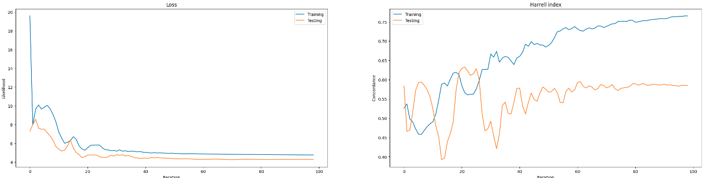

# Reporte del Modelo Baseline

## Descripción del modelo

Como modelo base se utiliza una regresión de Cox que toma en consideración únicamente el evento de muerte, más haya de ello el resto de eventos presentes son tomados como posibles censuras.

## Variables de entrada

Como variable de entrada se utilizan las 2048 características extraídas por medio de una ResNet50 V2 preentrenada en image net.

## Variable objetivo

Como variable objetivo se utiliza el tiempo hasta la falla (evento de muerte).
## Evaluación del modelo

### Métricas de evaluación

- Índice de Harrell:  introducido en Harrell et al. 1982, es una medida de bondad de ajuste para modelos que producen puntuaciones de riesgo. Se suele utilizar para evaluar modelos de riesgo en análisis de supervivencia, en los que los datos pueden estar censurados

La intuición que subyace al índice C de Harrell es la siguiente. Para el paciente i, nuestro modelo de riesgo asigna una puntuación de riesgo \eta_i. Si nuestro modelo de riesgo es bueno, los pacientes con tiempos más cortos hasta la enfermedad deberían tener puntuaciones de riesgo más altas. Reduciendo esta intuición a dos pacientes: el paciente con la puntuación de riesgo más alta debería tener un tiempo hasta la enfermedad más corto.

### Resultados de evaluación

| metrica | valor  |
|------|---------|
| Verosimilitud | 4.3064 | 
| Conocrdancia | 0.5849 | 

## Análisis de los resultados

- Se identifica un índice de concordancia que supera mínimamente la aleatoriedad, señalando que si bien el modelo es capaz de aprender patrones a través de las imágenes, este aún tiene un amplio margen de mejora. 

- La alta presencia de censuras dificulta el entrenamiento del modelo y hace inestables sus curvas de aprendizaje, posiblemente el uso de métodos que aprovechen la información censurada permitan mejorar su desempeño. 
