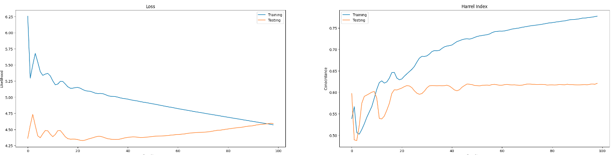

# Reporte del Modelo Final

## Resumen Ejecutivo

## Descripción del Problema

Uno de los mayores problemas de los modelos de sobrevivencia es el manejo de las censuras. Si bien modelos como la regresión de Cox están adaptados para lidiar con esta, las observaciones censuradas son poco significativas, lo que en conjuntos con alta prevalencia de este fenómeno suelen generar modelos sobre ajustados y poco generalizables. 

## Descripción del Modelo

Como respuesta a este problema se realizan varios cambios al modelo original:

- Se decide aumentar la complejidad del modelo empleando un preceptron multicapa entrenado con la misma pérdida, se espera que esto permita encontrar relaciones no lineales entre las características de la imagen y el tiempo hasta la falla. 

- Se añade el evento de sobrevivencia en paralelo al de muerte, generando una representación robusta capaz de representar el riesgo en varios casos, por lo cual los pacientes censurados resultan más informativos. 

## Evaluación del Modelo

| metrica | valor  |
|------|---------|
| Verosimilitud | 4.5922 | 
| Conocrdancia | 0.6210 | 
## Conclusiones y Recomendaciones

En esta sección se presentarán las conclusiones y recomendaciones a partir de los resultados obtenidos. Se deben incluir los puntos fuertes y débiles del modelo, las limitaciones y los posibles escenarios de aplicación.

## Referencias

En esta sección se deben incluir las referencias bibliográficas y fuentes de información utilizadas en el desarrollo del modelo.
